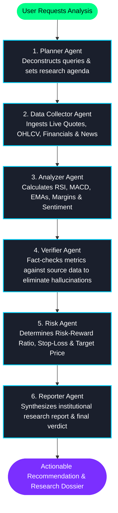

<div align="center">

# ⚡ StockAI Agent

### Autonomous Multi-Agent AI System for Indian Stock Market Intelligence

[](https://nextjs.org/)
[](https://react.dev/)
[](https://fastapi.tiangolo.com/)
[](https://langchain-ai.github.io/langgraph/)
[](https://groq.com/)
[](https://tailwindcss.com/)
[](https://supabase.com/)

<p align="center">
  A state-of-the-art AI-driven equity research and trading intelligence platform designed specifically for <b>NSE/BSE Indian equities</b>. Powered by a collaborative 6-agent LangGraph pipeline, real-time technical indicators, live market feeds, institutional-grade screener, and interactive TradingView charts.
</p>

</div>

---

## 📑 Table of Contents

- [🌟 Key Features](#-key-features)
- [🧠 Autonomous Multi-Agent Architecture](#-autonomous-multi-agent-architecture)
- [🛠️ Tech Stack](#️-tech-stack)
- [📁 Project Structure](#-project-structure)
- [🚀 Quick Start Guide](#-quick-start-guide)
  - [Prerequisites](#prerequisites)
  - [1. Clone Repository](#1-clone-repository)
  - [2. Backend Setup](#2-backend-setup)
  - [3. Frontend Setup](#3-frontend-setup)
- [🔑 Environment Variables](#-environment-variables)
- [📡 API Endpoints](#-api-endpoints)
- [🚢 Deployment Guide](#-deployment-guide)
- [🛡️ Security & Disclaimers](#️-security--disclaimers)
- [📄 License](#-license)

---

## 🌟 Key Features

### 🤖 1. 6-Agent Autonomous Research Pipeline
- **Orchestrated LangGraph Workflow**: Six specialized AI agents execute planning, data ingestion, technical analysis, quality assurance verification, risk management, and report generation in sequence.
- **Actionable Investment Verdicts**: Clear recommendations (`STRONG BUY`, `BUY`, `HOLD`, `SELL`, `STRONG SELL`) with dynamic confidence scores, calculated price targets, and stop-loss boundaries.

### 📊 2. Live Market Intelligence Dashboard
- **Instant Quotes & Valuations**: Real-time NSE/BSE stock pricing, daily change, volume, Day High/Low, 52-Week High/Low, **P/E Ratio**, and **Market Capitalization** formatted in Indian denominations (Crores & Lakh Crores / Trillions).
- **Interactive Technical Candlestick Charts**: Powered by TradingView's Lightweight Charts with toggleable EMA 20 & EMA 50 overlays, volume histograms, and responsive multi-timeframe intervals (1D, 1W, 1M, 3M, 1Y, 5Y).
- **Live Financial News & Sentiment**: Real-time scraped stock headlines analyzed for market sentiment and momentum catalysts.

### 🔍 3. Institutional-Grade Stock Screener
- **Pre-Built Presets**: Rapidly scan across Nifty 50 & leading NSE stocks with one click:
  - 🔥 **Top Gainers** (Up +2% today)
  - 📉 **Top Losers** (Down -2% today)
  - 💎 **Undervalued** (P/E below 15)
  - 🚀 **High ROE** (Return on Equity above 20%)
  - 💵 **Mid-Range** (₹500 – ₹2,000 price band)
- **Custom Parametric Filters**: Filter dynamically by Min/Max Price, P/E Ratio, Daily Change %, and ROE %.

### 💼 4. Portfolio Tracking & Paper Trading
- **Watchlist & Live Alerts**: Pin favorite tickers with instant synchronization to user account storage.
- **Trade Execution Simulation**: Log paper trades, calculate average entry prices, real-time unrealized/realized P&L, and position allocations.

---

## 🧠 Autonomous Multi-Agent Architecture

The core decision engine is modeled as an asynchronous state graph using **LangGraph**:



---

## 🛠️ Tech Stack

### Frontend
- **Framework**: Next.js 16 (App Router with Turbopack)
- **Library**: React 19
- **Styling**: Tailwind CSS, Vanilla CSS glassmorphism, responsive grid layouts
- **Charting**: TradingView Lightweight Charts v5
- **Icons**: Lucide React
- **Authentication & Database**: Supabase Client SDK

### Backend
- **Framework**: FastAPI (Python 3.10+)
- **Server**: Uvicorn (ASGI)
- **Agent Framework**: LangGraph & LangChain
- **LLM Engine**: Groq Cloud SDK (`openai/gpt-oss-20b`, LLaMA 3.3 70B)
- **Market Data Engine**: `yfinance` with `curl_cffi` fallback scraping & in-memory TTL caching
- **Financial Analytics**: `pandas`, `numpy`, `ta` (Technical Analysis library)

---

## 📁 Project Structure

```text
stock-ai-agent/
├── backend/
│   ├── agents/                   # LangGraph Multi-Agent Team
│   │   ├── planner.py            # Analysis scope & planning agent
│   │   ├── collector.py          # Market & financial data collector
│   │   ├── analyzer.py           # Technical & fundamental analyzer
│   │   ├── verifier.py           # Cross-validation & anti-hallucination agent
│   │   ├── risk_agent.py         # Position sizing & risk metrics
│   │   ├── reporter.py           # Synthesis & report generator
│   │   ├── state.py              # LangGraph AgentState definitions
│   │   └── graph.py              # Pipeline execution & workflow graph
│   ├── api/
│   │   └── routes/
│   │       ├── market.py         # Real-time prices, history, financials, news
│   │       └── analysis.py       # Synchronous & background AI analysis endpoints
│   ├── core/
│   │   └── config.py             # App settings, environment configs, CORS
│   ├── data/
│   │   ├── market_data.py        # Yahoo Finance quote scraping & robust fallbacks
│   │   ├── financials.py         # Balance sheets, margins, P/E & ROE extractor
│   │   └── news_fetcher.py       # Live financial news scraper & aggregator
│   ├── main.py                   # FastAPI entrypoint, middleware, rate limiter
│   └── requirements.txt          # Python dependencies
│
├── frontend/
│   ├── app/
│   │   ├── (auth)/               # Login & Signup views
│   │   ├── components/           # Navbar, StockChart, TickerStrip, NewsPanel, etc.
│   │   ├── dashboard/            # Core analysis & real-time equity overview
│   │   ├── screener/             # Parametric & preset NSE stock screener
│   │   ├── portfolio/            # Position tracking & simulation
│   │   ├── watchlist/            # Saved tickers & tracking
│   │   ├── trades/               # Trade execution log
│   │   ├── globals.css           # Custom theme variables, neon & glass styles
│   │   └── layout.tsx            # Global metadata & AuthProvider wrapper
│   ├── package.json              # Node dependencies & Next.js scripts
│   └── next.config.ts            # Next.js & Turbopack configurations
│
├── .vscode/                      # Editor configuration for Python environments
├── pyrightconfig.json            # Language server type checking paths
└── README.md
```

---

## 🚀 Quick Start Guide

### Prerequisites
- **Node.js**: `v18.18.0` or higher (Node 20 recommended)
- **Python**: `3.10` or higher
- **Git**
- **Free API Keys**:
  - [Groq Cloud](https://console.groq.com/) (for ultra-fast LLM inference)
  - [Supabase](https://supabase.com/) (for auth & database persistence)

---

### 1. Clone Repository

```bash
git clone https://github.com/PavanCodeNexus/stock-ai-agent.git
cd stock-ai-agent
```

---

### 2. Backend Setup

1. Navigate to the `backend` directory:
   ```bash
   cd backend
   ```

2. Create and activate a Python virtual environment:
   ```bash
   # Windows (PowerShell)
   python -m venv venv
   .\venv\Scripts\activate

   # macOS / Linux
   python3 -m venv venv
   source venv/bin/activate
   ```

3. Install required Python packages:
   ```bash
   pip install -r requirements.txt
   ```

4. Create a `.env` file in the `backend/` directory:
   ```env
   APP_NAME="Stock AI Agent"
   ENVIRONMENT="development"
   FRONTEND_URL="http://localhost:3000"

   # LLM Provider
   GROQ_API_KEY="your_groq_api_key_here"

   # Supabase
   SUPABASE_URL="https://your-project.supabase.co"
   SUPABASE_KEY="your-supabase-anon-or-service-key"
   ```

5. Run the FastAPI development server:
   ```bash
   uvicorn main:app --reload --host 127.0.0.1 --port 8000
   ```
   *The backend will be live at `http://127.0.0.1:8000` (API Docs at `http://127.0.0.1:8000/docs`).*

---

### 3. Frontend Setup

1. Open a new terminal and navigate to the `frontend` directory:
   ```bash
   cd frontend
   ```

2. Install dependencies:
   ```bash
   npm install
   ```

3. Create a `.env.local` file in the `frontend/` directory:
   ```env
   NEXT_PUBLIC_API_URL=http://localhost:8000
   NEXT_PUBLIC_SUPABASE_URL=https://your-project.supabase.co
   NEXT_PUBLIC_SUPABASE_ANON_KEY=your-supabase-anon-key
   ```

4. Run the Next.js development server:
   ```bash
   npm run dev
   ```
   *The application will be live at `http://localhost:3000`.*

---

## 🔑 Environment Variables

### Backend (`backend/.env`)
| Variable | Required | Description |
| :--- | :---: | :--- |
| `GROQ_API_KEY` | **Yes** | API key from Groq Cloud for LLM inference |
| `SUPABASE_URL` | **Yes** | Supabase project URL |
| `SUPABASE_KEY` | **Yes** | Supabase anon/public or service role key |
| `FRONTEND_URL` | No | Comma-separated allowed CORS origins (default: `http://localhost:3000`) |
| `ALLOW_VERCEL_PREVIEWS` | No | Enables wildcard regex CORS for `*.vercel.app` (default: `true`) |

### Frontend (`frontend/.env.local`)
| Variable | Required | Description |
| :--- | :---: | :--- |
| `NEXT_PUBLIC_API_URL` | **Yes** | URL pointing to your backend FastAPI server |
| `NEXT_PUBLIC_SUPABASE_URL` | **Yes** | Supabase project endpoint |
| `NEXT_PUBLIC_SUPABASE_ANON_KEY` | **Yes** | Public Supabase anon key |

---

## 📡 API Endpoints

| Method | Endpoint | Description |
| :--- | :--- | :--- |
| `GET` | `/health` | Server health check |
| `GET` | `/api/market/price/{symbol}` | Real-time price, day high/low, 52W high/low, PE, & Market Cap |
| `GET` | `/api/market/history/{symbol}?period=3mo` | Historical OHLCV series for TradingView charting |
| `GET` | `/api/market/financials/{symbol}` | Key valuation, profitability, ROE, margins, and ratios |
| `GET` | `/api/market/company/{symbol}` | Sector, industry, profile, and executive metadata |
| `GET` | `/api/market/news/{symbol}` | Aggregated and sentiment-tagged market headlines |
| `GET` | `/api/market/overview` | Nifty 50 and BSE Sensex benchmark performance |
| `POST`| `/api/analysis/analyze-sync/{symbol}` | Triggers 6-agent LangGraph analysis and returns complete report |

---

## 🚢 Deployment Guide

### Deploy Frontend on Vercel
1. Push your repository to GitHub.
2. Import the repository into [Vercel](https://vercel.com/).
3. In Project Settings, set the **Root Directory** to `frontend`.
4. Configure the Environment Variables:
   - `NEXT_PUBLIC_API_URL`: `https://your-backend-service.onrender.com`
   - `NEXT_PUBLIC_SUPABASE_URL`: `https://your-project.supabase.co`
   - `NEXT_PUBLIC_SUPABASE_ANON_KEY`: `your-anon-key`
5. Click **Deploy**.

### Deploy Backend on Render / Railway
1. Create a new **Web Service** on [Render](https://render.com/) or [Railway](https://railway.app/).
2. Point to the `backend/` directory.
3. Set the build and start commands:
   - **Build Command**: `pip install -r requirements.txt`
   - **Start Command**: `uvicorn main:app --host 0.0.0.0 --port $PORT`
4. Set the environment variables (`GROQ_API_KEY`, `SUPABASE_URL`, `SUPABASE_KEY`, `FRONTEND_URL`).
5. Deploy and copy the production service URL into your Vercel `NEXT_PUBLIC_API_URL`.

---

## 🛡️ Security & Disclaimers

> [!WARNING]
> **Financial Disclaimer**: This application is built for educational, analytical, and informational purposes only. It does not constitute formal financial, investment, or trading advice. Stock markets are subject to high market risks; always consult a certified financial advisor before making actual capital investments.

---

## 📄 License

This project is open-source under the [MIT License](LICENSE).

<div align="center">
  <sub>Built with ❤️ for Indian Equity Investors and Quantitative Enthusiasts.</sub>
</div>